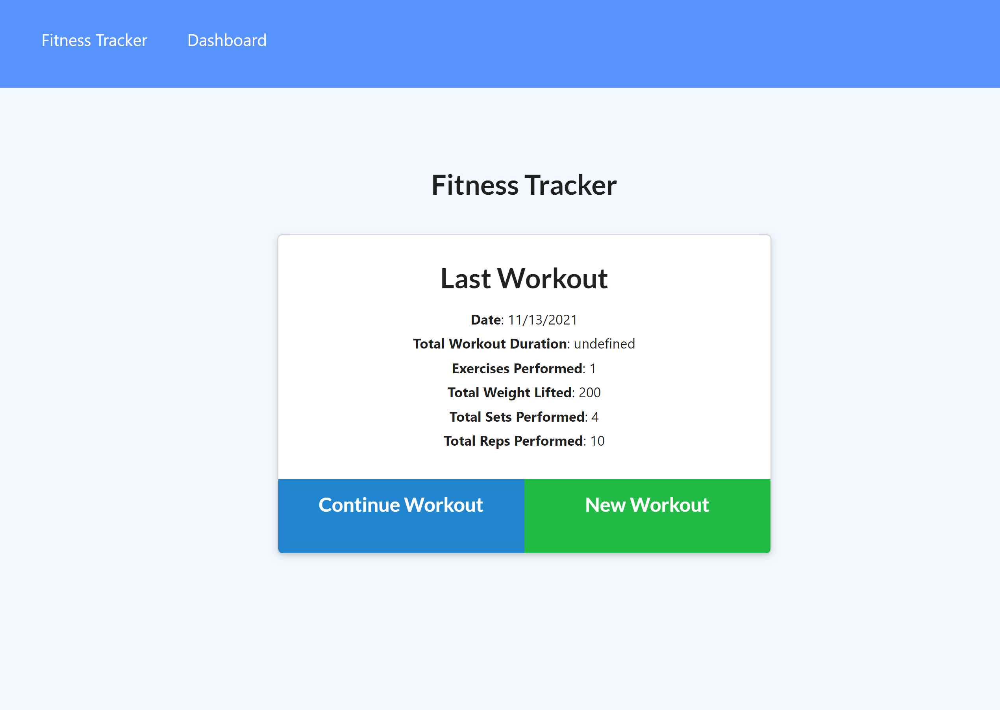

# fitnessTracker

Assignment:
Add onto existing code so that routes for displaying and adding workout data are now functional. Need to write out routes, server files and models and ensure all are working in tandem with original code.

Image:
</img>

Links:
https://github.com/Jcarps97/fitnessTracker
https://jcarps97.github.io/fitnessTracker/